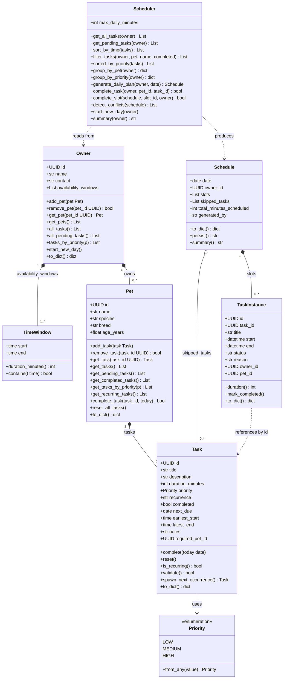

# PawPal+ — Final Class Diagram

## Key relationships added vs. initial design

| Relationship | Why it was added |
|---|---|
| `Task.required_pet_id → Pet.id` | Lets each task slot know which pet it belongs to |
| `Task.next_due` | Stores the next recurrence date after completion |
| `Owner.availability_windows: List[TimeWindow]` | Replaces single start/end; supports morning + evening blocks |
| `Schedule` wraps `List[TaskInstance]` | Keeps date, totals, and skipped tasks together with the slots |
| `Scheduler.sort_by_time / filter_tasks / detect_conflicts` | New algorithmic methods added in Phase 3 |
